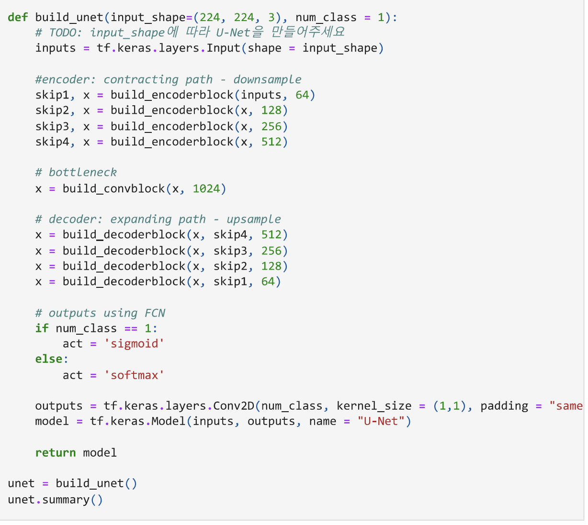
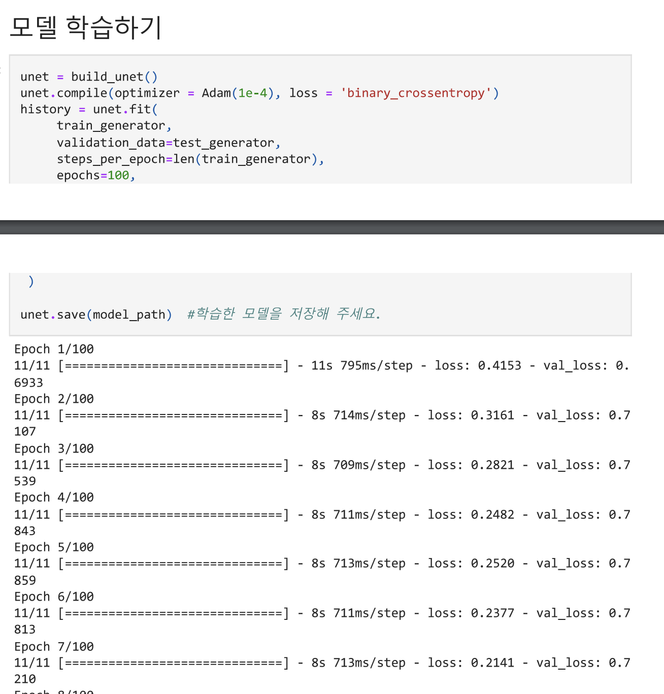
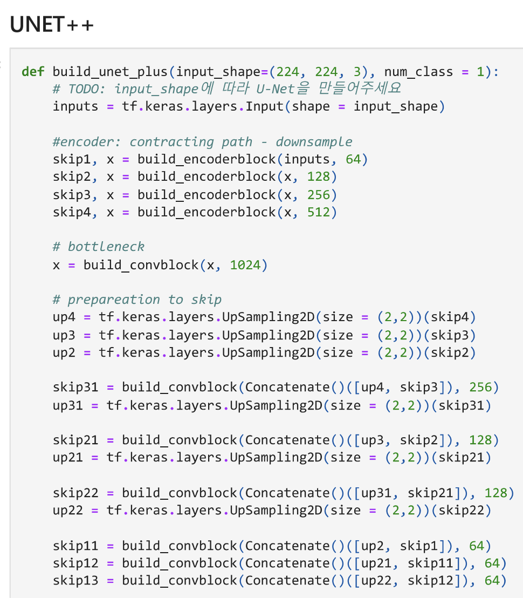
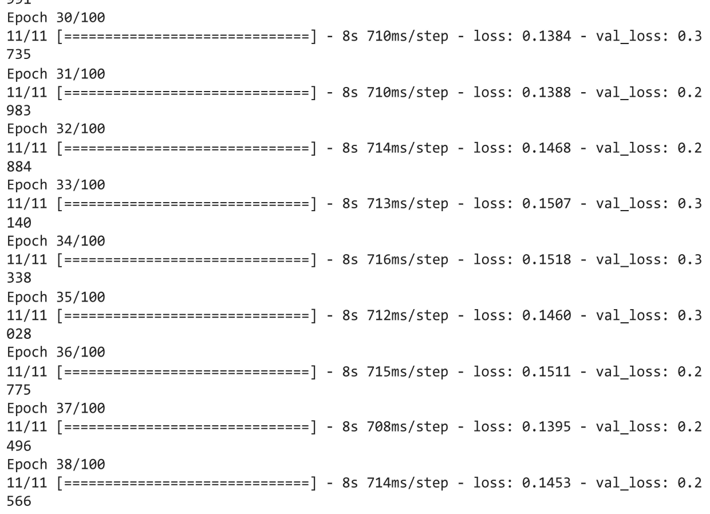
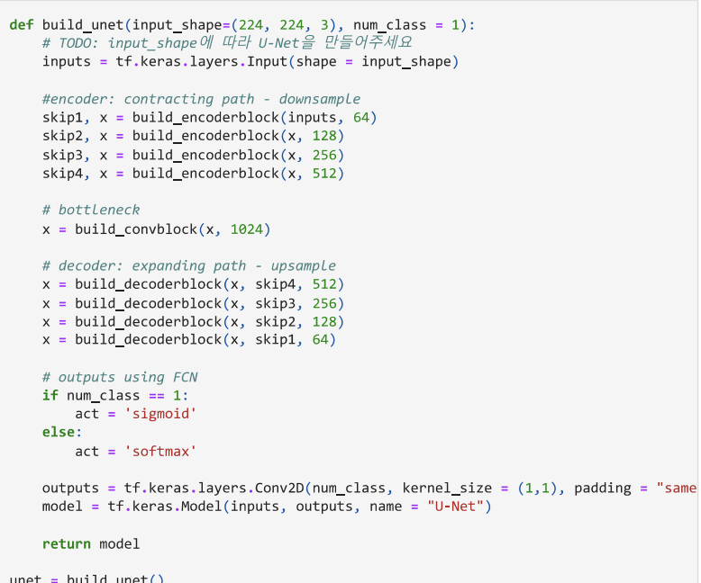
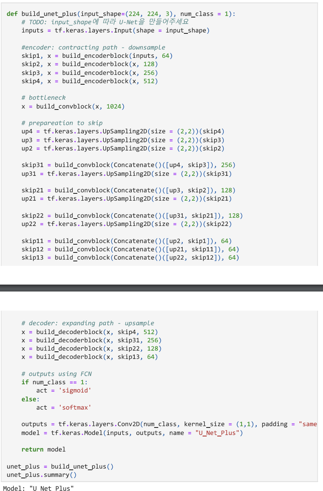
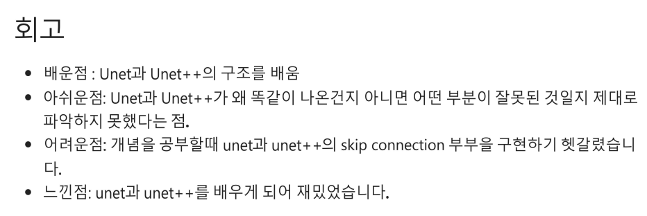
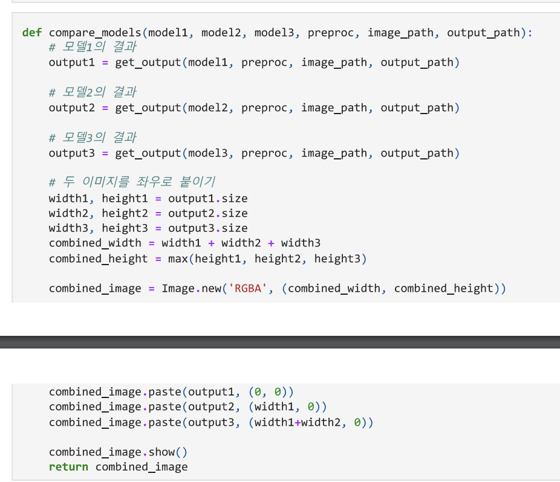
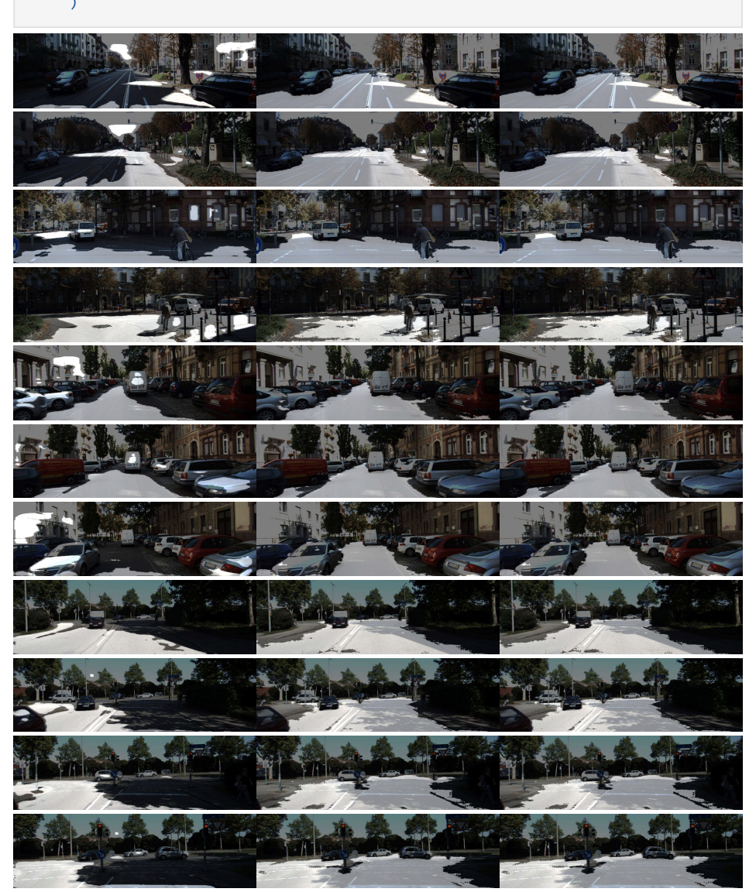
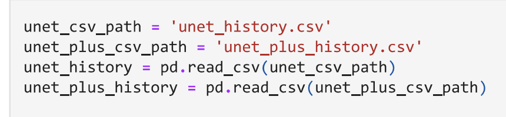

🔑 **PRT(Peer Review Template)**

코더: 윤소정

리뷰어: 현동철

- [x] **1. 주어진 문제를 해결하는 완성된 코드가 제출되었나요?**

  - 문제에서 요구하는 기능이 정상적으로 작동하는지? - 해당 조건을 만족하는 부분의 코드 및 결과물을 근거로 첨부
    
    
    
    

- [x] **2. 핵심적이거나 복잡하고 이해하기 어려운 부분에 작성된 설명을 보고 해당 코드가 잘 이해되었나요?**
  - 해당 코드 블럭에 doc string/annotation/markdown이 달려 있는지 확인
  - 해당 코드가 무슨 기능을 하는지, 왜 그렇게 짜여진건지, 작동 메커니즘이 뭔지 기술.
  - 주석을 보고 코드 이해가 잘 되었는지 확인
    - 잘 작성되었다고 생각되는 부분을 근거로 첨부합니다.
    - skip, down sampling, bottlenck, decoker, FCN을 하는 부분임을 기술해주셨다.
    - 
    - 
- [x] **3.** 에러가 난 부분을 디버깅하여 “문제를 해결한 기록”을 남겼나요? 또는
      “새로운 시도 및 추가 실험”을 해봤나요? \*\*\*\*
  - 문제 원인 및 해결 과정을 잘 기록하였는지 확인 또는
  - 문제에서 요구하는 조건에 더해 추가적으로 수행한 나만의 시도,
    실험이 기록되어 있는지 확인 - 잘 작성되었다고 생각되는 부분을 근거로 첨부합니다.
- [x] **4. 회고를 잘 작성했나요?**

  - 프로젝트 결과물에 대해 배운점과 아쉬운점, 느낀점 등이 상세히 기록 되어 있나요?
  - 

- [x] **5. 코드가 간결하고 효율적인가요?**
  - 코드 중복을 최소화하고 범용적으로 사용할 수 있도록 모듈화(함수화) 했는지
    - 잘 작성되었다고 생각되는 부분을 근거로 첨부합니다.
    - 
    - 
    - U-Net과 U-Net++을 한번에 비교할 수 있도록 함수를 작성해주셨다.

추가 리뷰

- 저는 어제 U-Net 100번을 돌려놨어서 history출력결과를 저장할 생각은 못했었는데 좋은 습관인거 같습니다!
  
